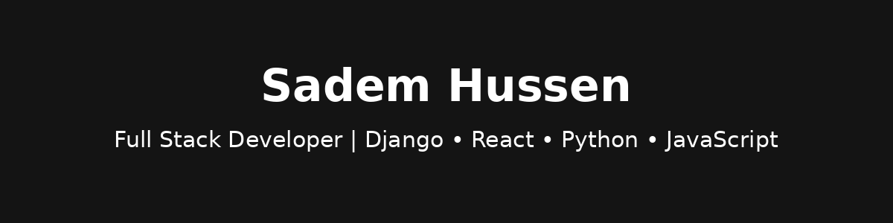

<!-- Profile banner (you can replace with your own or use a tool like shields.io/banner or svg generator) -->

  

  

<h1 align="center">Hey, I'm Sadem Hussen 👋</h1>

  Full Stack Developer | Clean Code Enthusiast | Always Shipping

---

### 💼 About Me

- 🔭 Working on full stack apps with Django & React
- 🌱 Exploring system design, testing, and DevOps
- ⚙️ Tech stack includes: Python, JavaScript, Django, React, PostgreSQL
- 🤝 Open to collaboration on meaningful tech projects
- 📫 Let's connect: [LinkedIn](linkedin.com/in/sadem-h/) . [PORTIFOLIO](https://my-cite.onrender.com/)

---

### 🧰 Tech Toolbox

  
  
  
  
  
  
  

---

### 📈 GitHub Stats

  
  

---

### 🧠 

> "First, started from hello world . Then, hello real world!!!." 

---

<!-- Optional: Contribution streak graph -->
<!--

  

-->

